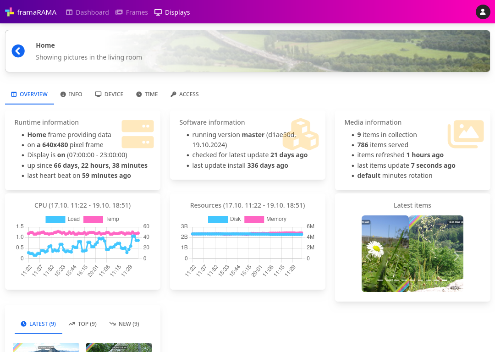

# framaRAMA


Keep your memories alive with framaRAMA. The smart way to show your memories from
a photo collection on a digital photo frame.

Features:

* 📷 configure multiple different sets of photos
* 📺 show them on different devices
* 🤝 integrate you own photo collections
* 🎯 priorize the photos to show by meta data (e.g. date taken)
* 🪄 add make up to your photos (resize, write text, etc)
* 🍿 enjoy your memories
* ... and more - checkout the [documentation](https://framarama.github.io/framarama/)!



## 🚀 How to start

The software consists of mainly two parts:

* the **server** component, for administration and management
* the **frontend** component, for displaying the photos

In the standard setup both components will run on the same device. In this case
the configuration and the display of photos will be handled by the this device.

To be able to adminstrate and manage multiple devices centrally and only display
the photos on several other devices, the server can be installed on a single
central device and the frontend on the several other devices showing the images.

This setup requires access from the frontend devices to the central device
running the server component.

### ⚙ General setup

Follow the steps below to setup both components on the same system. If you
want to separate them, see sections below.

📢 Before starting check the requirements of the components below and install
them if required (enable them in requirements/config.txt):
* mysqlclient==2.1.0 - if you want to use MySQL as backend (configuration
  see below)


```
git clone https://github.com/framaRAMA/framarama.git framarama
cd  framarama
mkdir data
python -m venv venv
. ./venv/bin/activate
pip install -r requirements/default.txt
```

Running both components on one system, set `MODES` in `framarama/settings.py`:
```
    'MODES': [
        'server',
        'frontend'
    ],
```

To use an external database change `DATABASE` in `framarama/settings.py`:
```
  'default': {
    'NAME': 'dbname',
    'ENGINE': 'django.db.backends.mysql',
    'USER': 'dbuser',
    'PASSWORD': 'dbpassword',
    'HOST': 'dbhost',
  }
```

Initial setup:
```
python manage.py migrate
python manage.py collectstatic
python manage.py createsuperuser
python manage.py setup --set mode=local
python manage.py setup --set local_db_type=local
```

Start application (flag `--insecure` is required to serve static files):
```
python manage.py runserver 0.0.0.0:8000 --noreload --insecure
```

... and navigate browser to

* http://server:8000/config/ for server setup or
* http://server:8000/frontend/ for frontend setup

Enjoy!


### 🏢 Server setup

This component is the central place where all the configuration and
setup is done. It is providing a web interface to setup your photo collection
and assign them to different frames or displays.

Checkout the project as mentioned before and adjust the configuration:
```
    'MODES': [
        'server',
        #'frontend'
    ],
```

The server component depends on the following dependencies:

* ☝ `python3`, `python3-venv`, `python3-dev` - standard Python environment
* ☝ `gsfonts`, `gsfonts-other`, `fonts-liberation`, `fonts-urw-base35`, `fonts-freefont-ttf`, `fonts-freefont-otf` - fonts support, might be other packages (install them and check via `convert -list font`)
* 💡 `libmariadb3` - for external database support

When just running the server component, setup the initial configuration using
following command:
```
python manage.py setup --set mode=cloud
```

After application startup you can open the server setup in the browser.

### 📺 Frontend setup

This component is used to retrieve data from the server component and
prepare the photo to display it - usually - locally on the display
connected to the device.

Checkout the project as mentioned before and adjust the configuration:
```
    'MODES': [
        #'server',
        'frontend'
    ],
```

The frontend component depends on the following dependencies:

* ☝ `python3`, `python3-venv`, `python3-dev` - standard Python environment
* 💡 `network-manager`, `dnsmasq-base` - configuring and setting up networking
* 💡 `plymouth`, `plymouth-themes`, `plymouth-x11` - create startup booting screen
* 💡 `xserver-xorg`, `xrandr|x11-server-utils`, `xinit`, `openbox`, `feh`, `imagemagick` - show pictures using graphical frontend
* 💡 `xinput` - register keystores for fallback commands

After application startup you can open the frontend setup in the browser.

## Docker

It is also possible to run the application using docker container. To
build the docker container checkout the source code and run the following
command:

```
docker build .
```

After this you can create a new container, e.g.:

```
docker container create \
  --name framarama \
  --publish "0.0.0.0:8000:8000/tcp" \
  --env 'TZ=Europe/Berlin' \
  --env 'DJANGO_DEBUG=True' \
  --env 'DJANGO_SECRET_KEY=some-really-secure-secret' \
  --env 'FRAMARAMA_MODES=server,frontend' \
  --env 'FRAMARAMA_PORT=8000' \
  --tty \
  --restart unless-stopped \
  --volume '/path/to/data:/home/framarama/data' \
  IMAGE_ID
```

## ☯ Final notes

This project was born because we all have large collection of photo but
don't regularly look at them to benefit. Maybe we have some photos
in some photo frames on walls or we have some of them in paper albums. But
how often do we look at them to enjoy the memory?

With this project you can resurrect you memories by showing your photos
on a digital photo frame.

If you like this project, please [donate](https://www.paypal.com/donate?hosted_button_id=5TDSCVP5X7QFA). Thanks!

