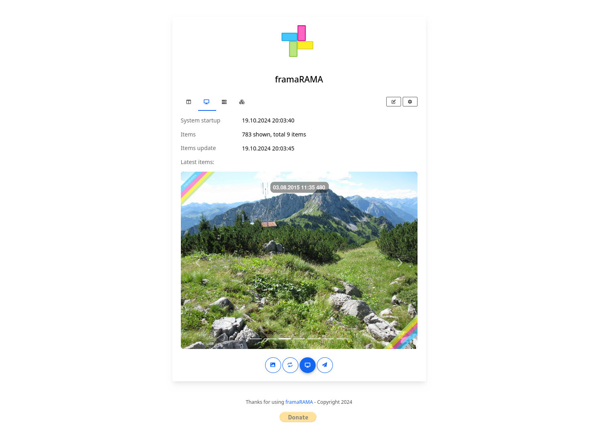

# Interface

The frontend web interface can be used to setup and configure the device
showing the photos.

Use the "⚙" (gear) button to change to the server component to update the
server configuration.

## Overview

The overview page shows the mode of the device (local or cloud setup) and
basic information.

Use the "✏" (pencil) button to change the mode setup.

## Display

To review and change the settings for the display open this page. It shows
the latest photos shown, it can be used to change the photo or toggle the
display.

Use the "✏" (pencil) button to change the display settings.

Use the "🖼" (photo) button to show the currently visible photo in the slides
(e.g. when switching back to the previous image).

Use the "🔁" (reload) button to immediately trigger a photo change.

Use the "📺" (display) button to toggle the display (switch on or off).

## Device

This page shows some technical information (like CPU load or memory usage).
It provides functions to configure the system.

Use the "🛜" (wifi) button to show wireless networks in range and connect to
one of them or to activate a wireless access point.

Use the "🗒" (file) button to show the recent log entries. Also shows the
service status.

Use the "↩" (restart) button to restart the device.

Use the "⏺" (stop) button to shut down the device.

## Software

The software page shows the version information the software running currently.
It can be used to update the version.

Use the "🔁" (reload) button to check for software updates.

Use the "⬇" (download) button to update to a given version.

